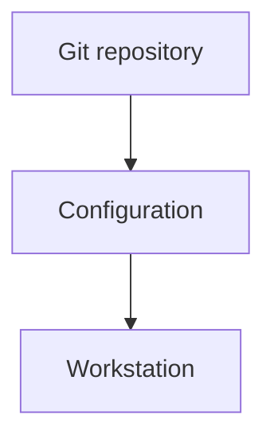
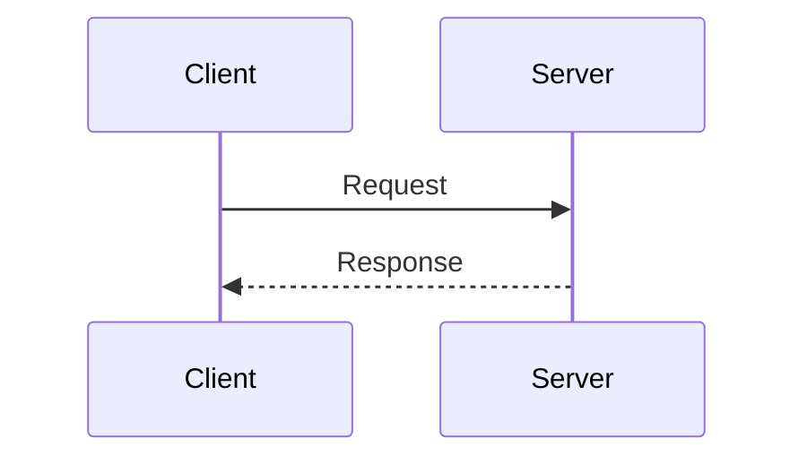

# Mermaid test


```mermaid
flowchart TD
    A[Git repository] --> B[Configuration]
    B --> C[Workstation]
```


```mermaid
sequenceDiagram
    participant Client
    participant Server
    Client->>Server: Request
    Server-->>Client: Response
```

```bash
printf 'ordinary code block\n'
```
